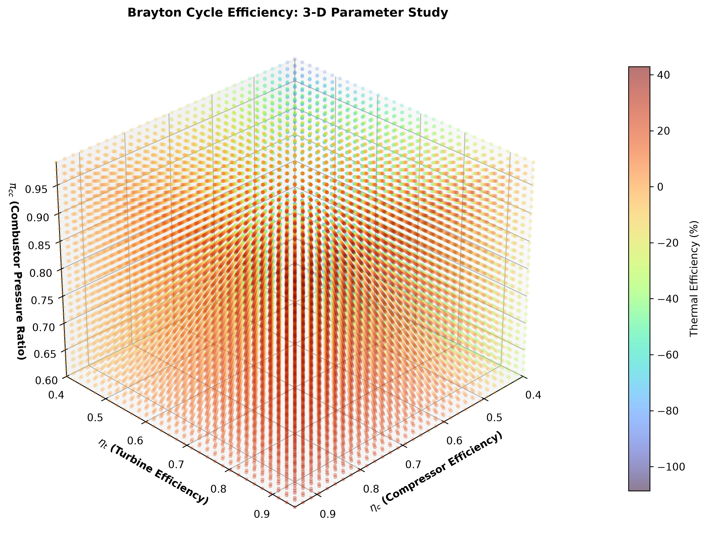

# Brayton Cycle Problem

MATLAB analysis of a Brayton cycle with a parametric study of:

- Compressor isentropic efficiency: **0.40 to 0.95**
- Turbine isentropic efficiency: **0.40 to 0.95**
- Combustor pressure ratio: **0.60 to 0.99**

The calculation evaluates the Brayton-cycle thermal efficiency over a 31 × 31 × 31 parameter grid, giving **29,791 combinations**.

## Main MATLAB file

`Brayton_Cycle_3D_Parameter_Study.m`

## 3-D result

The color of each point represents the calculated cycle thermal efficiency.

