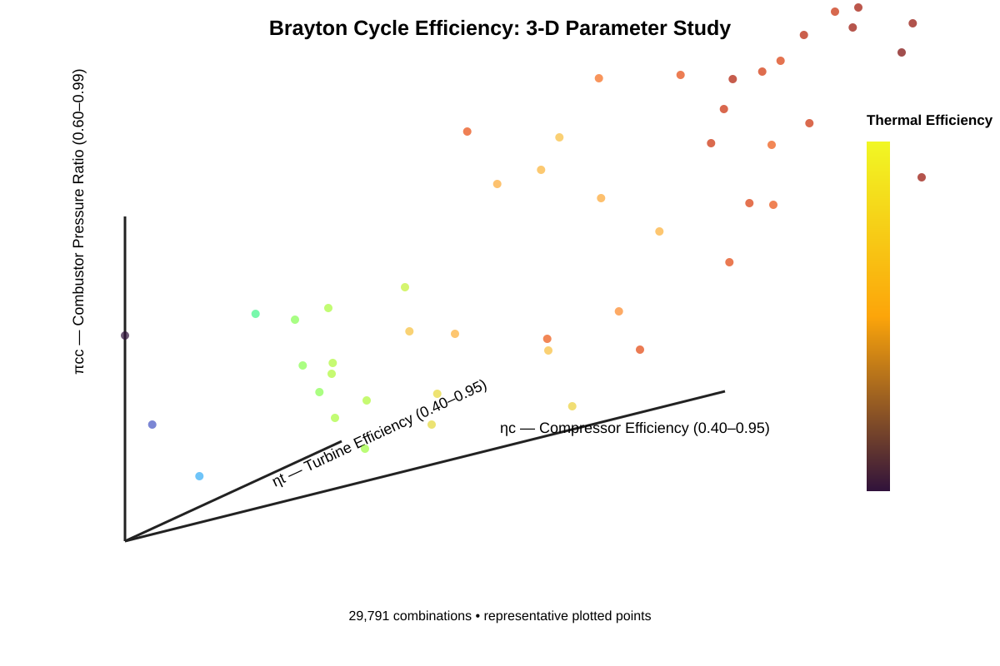
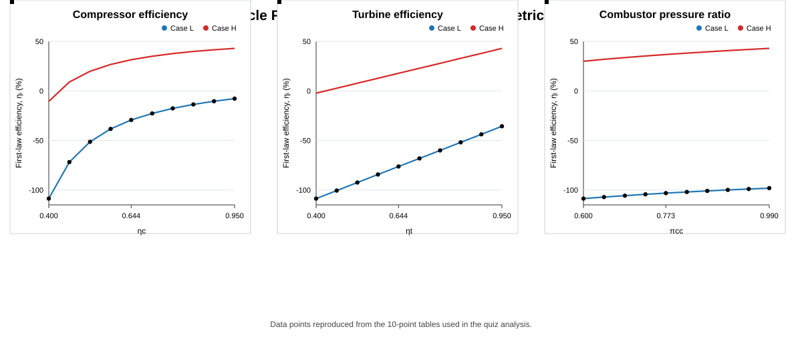

# Brayton Cycle Problem

A small **100% Python** computational analysis for the Brayton-cycle question.

## Parameter ranges

- Compressor isentropic efficiency, **ηc: 0.40–0.95**
- Turbine isentropic efficiency, **ηt: 0.40–0.95**
- Combustor pressure ratio, **πcc: 0.60–0.99**

The calculation evaluates **29,791 combinations** using 31 points for each parameter.

## Python implementation

The complete calculation and plotting are contained in:

`Brayton_Cycle_3D_Parameter_Study.py`

Install the required packages:

```bash
pip install numpy matplotlib
```

Then run:

```bash
python Brayton_Cycle_3D_Parameter_Study.py
```

The script calculates the Brayton-cycle thermal efficiency and generates the 3-D graph in `plots/3D_parameter_study.svg`.

## 3-D parameter study

The 3-D graph is generated directly by the Python script using **Matplotlib** from the full 29,791-point parameter sweep. A repository preview is also included below.



## 10-point first-law efficiency comparison

The following graph reproduces the **10 points used in the extreme-case tables** for compressor efficiency, turbine efficiency, and combustor pressure ratio. It shows how the first-law efficiency changes across the specified range for both the low and high extreme cases.



### Main inference

Over the investigated ranges, the first-law efficiency is most sensitive to **compressor efficiency**, followed by **turbine efficiency**, while **combustor pressure ratio has the smallest effect**.

- Compressor efficiency: 0.40 → 0.95
- Turbine efficiency: 0.40 → 0.95
- Combustor pressure ratio: 0.60 → 0.99

## Project contents

- **Python:** calculation + 3-D visualization
- **NumPy:** numerical parameter sweep
- **Matplotlib:** graph generation
- **10-point comparison:** extreme-case sensitivity analysis
- **No MATLAB files required**
